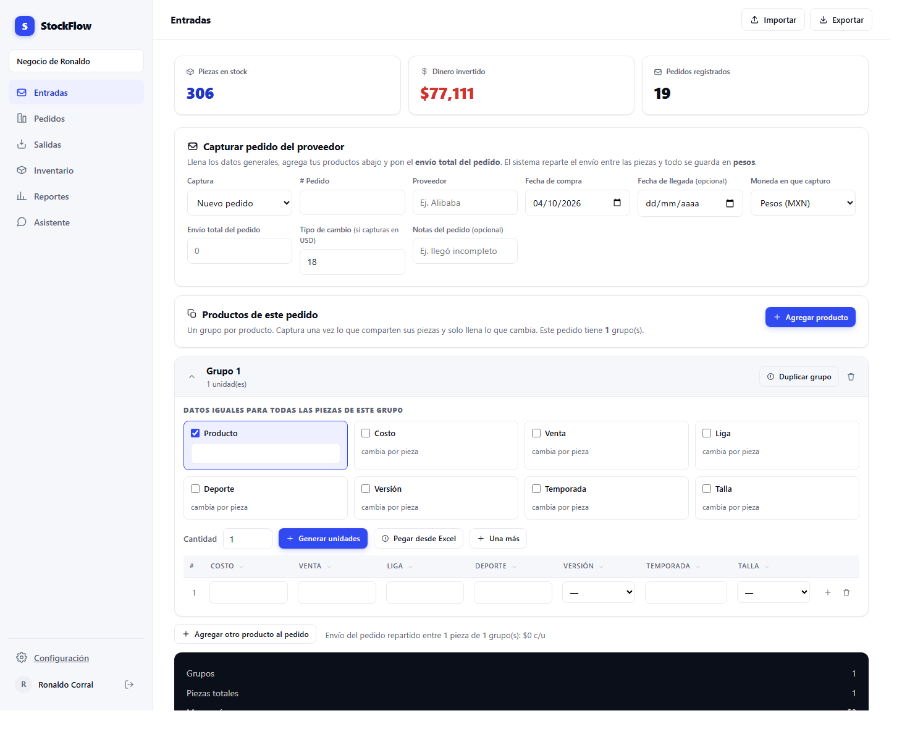
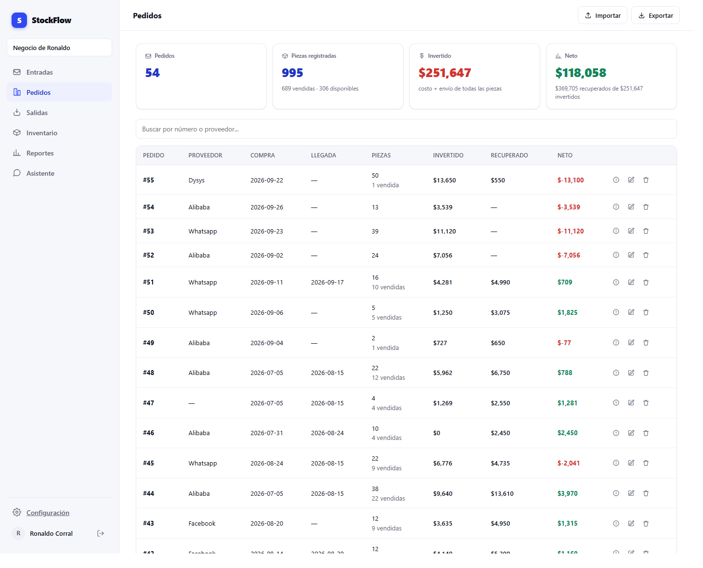
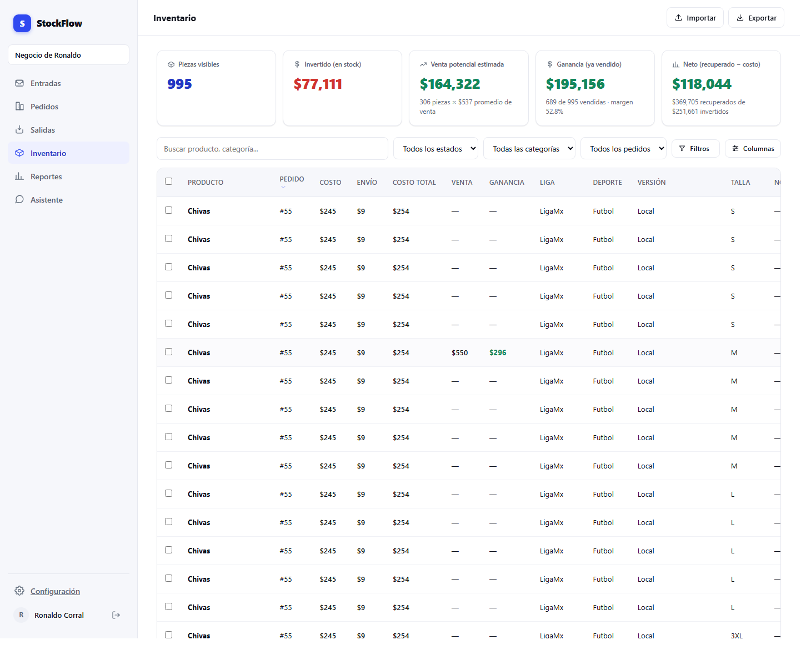
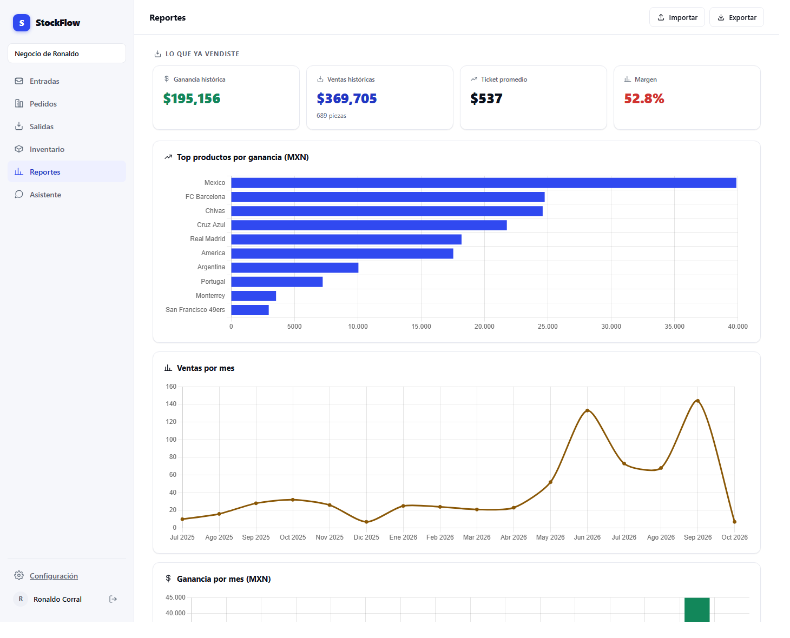
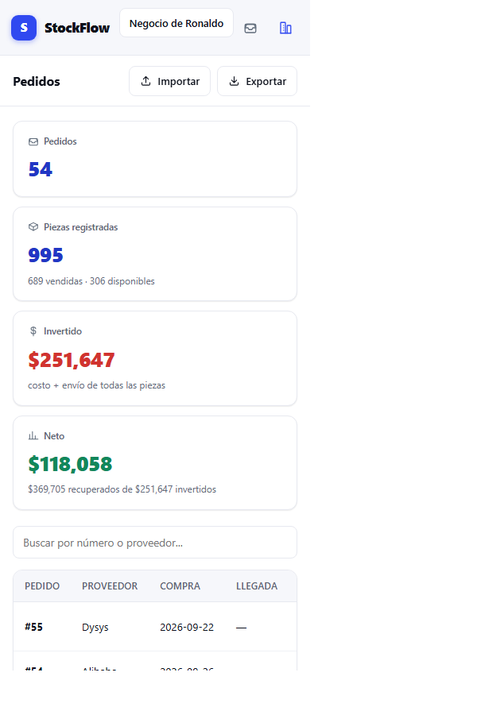
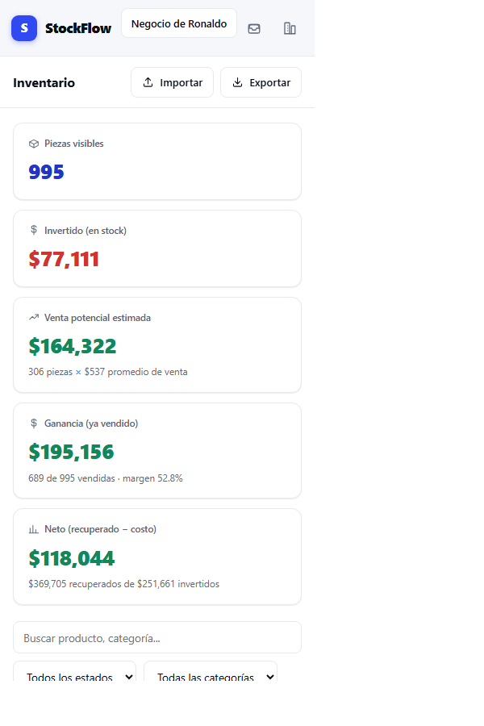

# StockFlow

**Control de inventario y análisis de ventas para revendedores.**

> *Cada pieza tiene su propia historia de ganancia.*

A diferencia de un inventario que promedia todo en un SKU, StockFlow guarda **una fila por
unidad física**. No registra «15 jerseys talla M»: registra 15 piezas, cada una con su costo,
su parte del envío y su propia fecha de venta. Eso es lo que permite responder *cuánto gané
con esta pieza* en vez de solo un promedio.

El sistema está en uso real con **995 piezas y 54 pedidos** de un negocio de reventa de jerseys.

---

| | |
|---|---|
| **Autor** | Ronaldo Corral — matrícula 369417 |
| **Materia** | Seminario de Programación |
| **Motor** | PHP 8.3 · MariaDB · JavaScript sin framework |
| **Dependencias** | Ninguna de servidor — sin Composer, sin npm, sin compilación |
| **Pruebas** | 333 de servidor + 15 de navegador |

---

## Las cinco pantallas

| Pantalla | Qué responde |
|---|---|
| **Entradas** | Registrar un pedido del proveedor con todas sus piezas |
| **Pedidos** | Ver, corregir y borrar lo registrado; rentabilidad por pedido |
| **Salidas** | Historial de ventas y margen de cada una |
| **Inventario** | Catálogo completo con filtros por cualquier campo configurado |
| **Reportes** | Productos más rentables, ventas por mes, proyección |
| **Asistente** | Preguntas en lenguaje natural sobre el inventario propio |

### Entradas — captura de un pedido



Se escribe **una sola vez** lo que comparten las piezas (producto, costo, liga, temporada) y
solo se llena lo que cambia por unidad, como la talla. El envío total del pedido se reparte
entre las piezas en **centavos exactos**, de modo que la suma de los costos individuales
siempre coincide con lo que realmente se pagó.

### Pedidos — consulta con resultados calculados



Por cada pedido: lo invertido, lo recuperado y el neto — en rojo mientras el pedido no se
paga solo, en verde cuando ya dejó ganancia. Las cifras se calculan desde las piezas reales
en cada consulta, nunca desde un contador guardado que pueda quedar desactualizado.

### Inventario



Las columnas **no están escritas en el código**: salen del registro de campos del negocio, y
cada usuario elige cuáles ver. Permite seleccionar varias piezas y editarlas en una sola
operación transaccional.

### Reportes



---

## Frontend adaptable

El mismo código responde a pantallas de teléfono: la barra lateral se vuelve una barra
superior con iconos, las tarjetas pasan de cuatro columnas a una, y las tablas anchas se
desplazan **dentro de su propio contenedor** en vez de desbordar la página.

Renders reales a 390 × 844 px:

<p>
  
  
</p>

---

## Arquitectura

```
NAVEGADOR
  Entradas · Pedidos · Salidas · Inventario · Reportes · Asistente
  Módulos JS sin framework · Chart.js · SheetJS
        │  fetch JSON + token CSRF en cada escritura
        ▼
SERVIDOR — PHP 8.3 sobre Apache
  api/          items · purchase_orders · attributes · suppliers · dashboard
                import · export · chat
        │
  SEGURIDAD    require_business (impone el negocio) · csrf_check
                Authz (5 roles) · límite de intentos por IP
        │       El cliente nunca elige el business_id ni un nombre de columna:
        │       manda CLAVES que el servidor resuelve contra listas blancas.
        │
  Servicios    PricingService · ImportExportService · SqlGuard
                AgentRunner · SchemaSemantics
  Modelos      InventoryItem · PurchaseOrder · AttributeDefinition
                Supplier · Business
        ▼
MariaDB — 15 tablas, aislamiento por business_id en toda consulta
  · usuario de la aplicación  → lectura y escritura
  · usuario del asistente     → solo SELECT, no puede escribir ni una fila
```

### El asistente de IA, y por qué no es peligroso

El modelo **propone** una consulta SQL. No la ejecuta. PHP la recibe y:

1. la valida con `SqlGuard` (solo lectura, solo tablas permitidas, sin `UNION`, con `LIMIT`),
2. le **impone** el `business_id` del contexto — el modelo nunca elige a qué negocio consultar,
3. la ejecuta con un usuario de base de datos **de solo lectura**.

---

## Diseño de datos

```
                    users ──────┐
                                │
  attribute_definitions ──► businesses ◄── business_users ──► roles ──► permissions
   (el registro de campos)      │                                        (role_permissions)
                                │
          suppliers ◄───────────┤
              ▲                 │
              │                 ▼
       purchase_orders ──► inventory_items ◄── chat_messages
                             UNA FILA POR PIEZA
                             name · attributes(JSON) · cost
                             shipping_cost · sale_price
                             total_cost y profit → columnas calculadas
```

Toda tabla de negocio cuelga de `businesses` con borrado en cascada: ese es el mecanismo del
aislamiento multi-negocio.

**Dos decisiones que explican el diseño:**

- **Los campos personalizados viven en JSON**, no en una columna por campo. Un negocio de
  jerseys necesita «talla» y «liga»; una joyería necesita «material» y «quilates». Con una
  columna por campo, cada giro exigiría migrar el esquema. Con `attributes` en JSON más el
  registro de campos, agregar un campo es un `INSERT` y la interfaz se redibuja sola.

- **`total_cost` y `profit` son columnas calculadas** por la base a partir de costo, envío y
  precio de venta. Al ser derivadas no pueden desincronizarse: no existe un camino para
  guardar una ganancia que no corresponda a sus propios números.

---

## Seguridad

| Medida | Dónde |
|---|---|
| Token anti-CSRF en toda escritura | `csrf_check()` |
| Consultas preparadas, sin concatenación | todos los modelos |
| Roles y permisos (5 roles) | `Authz` |
| Aislamiento por negocio impuesto por el servidor | `require_business()` |
| Límite de intentos de acceso por IP | tabla `rate_limits` |
| Contraseñas con `password_hash` (bcrypt) | `Auth` |
| Errores ocultos en producción | `APP_ENV=production` |
| `.env` y `config/` inaccesibles vía web | `.htaccess` (403) |

La aplicación **no escribe archivos en disco** y **no ejecuta código dinámico**: no hay
`$_FILES`, `move_uploaded_file`, `eval`, `exec` ni `shell_exec` en todo el proyecto. La
importación de Excel se procesa en el navegador y llega al servidor ya como datos.

---

## Correr el proyecto en local

```bash
git clone https://github.com/ronaldocorral33/StockFlow.git
```

1. Copia `config/config.example.php` a `config/config.php` (tal cual, no hay que editarlo).
2. Copia `.env.example` a `.env` y llena tus credenciales.
3. Crea la base y corre las migraciones **en orden** desde `sql/`:
   ```bash
   mysql --default-character-set=utf8mb4 -u root < sql/schema.sql
   ```
   > El `--default-character-set=utf8mb4` **no es opcional**: sin él, el servidor reinterpreta
   > los bytes y «Categoría» se guarda como «Categor├¡a», de forma permanente.
4. Pruebas: `php tests/run.php` y `node tests/js/grupos.test.js`

Para publicarlo en un hosting con cPanel, el procedimiento completo está en
**[DEPLOY.md](DEPLOY.md)**, incluidas las dos trampas que costaron un despliegue fallido: el
juego de caracteres al importar, y las columnas generadas que `mysqldump` incluye de más.

---

## Documentación del proyecto

| Archivo | Contenido |
|---|---|
| [PRODUCT.md](PRODUCT.md) | Qué problema resuelve y para quién |
| [DESIGN.md](DESIGN.md) | Sistema de diseño: paleta, tipografía, componentes |
| [DEPLOY.md](DEPLOY.md) | Despliegue en cPanel, paso a paso |

## Pruebas

```
333 pruebas de servidor   (php tests/run.php)
 15 pruebas de navegador  (node tests/js/grupos.test.js)
```

Corren sobre la base de datos real, no sobre simulaciones. Varias se validaron **rompiendo el
código a propósito** para confirmar que efectivamente detectan la falla: si el borrado de un
pedido se apoyara en la llave foránea en vez de borrar sus piezas explícitamente, la prueba
falla señalando las 4 piezas que quedarían huérfanas en el inventario.
